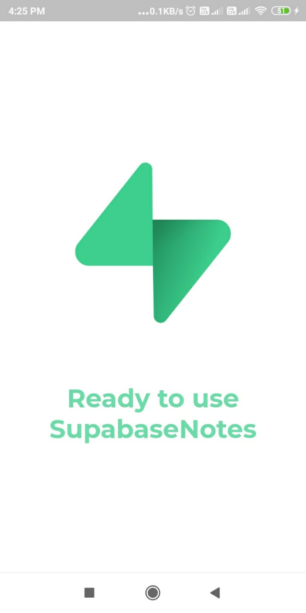
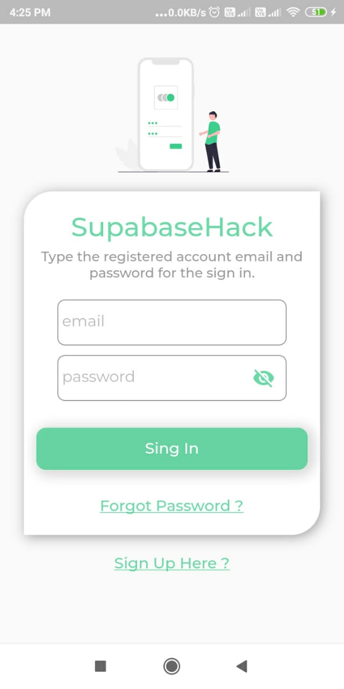
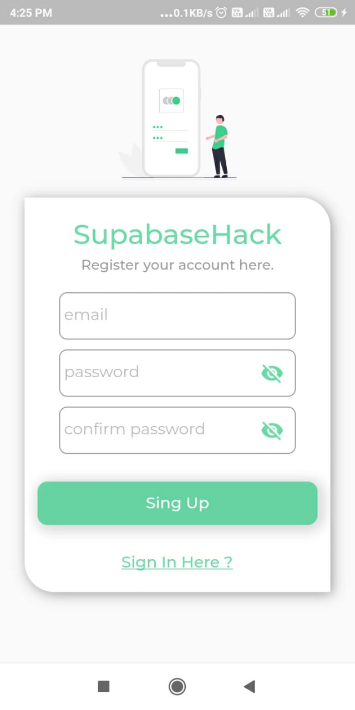
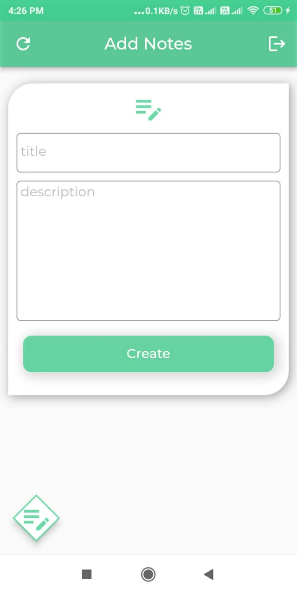
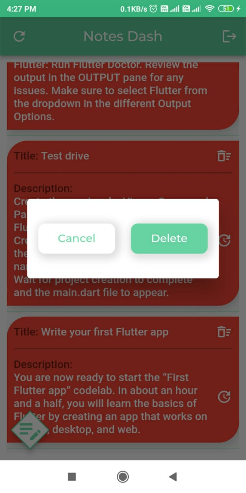
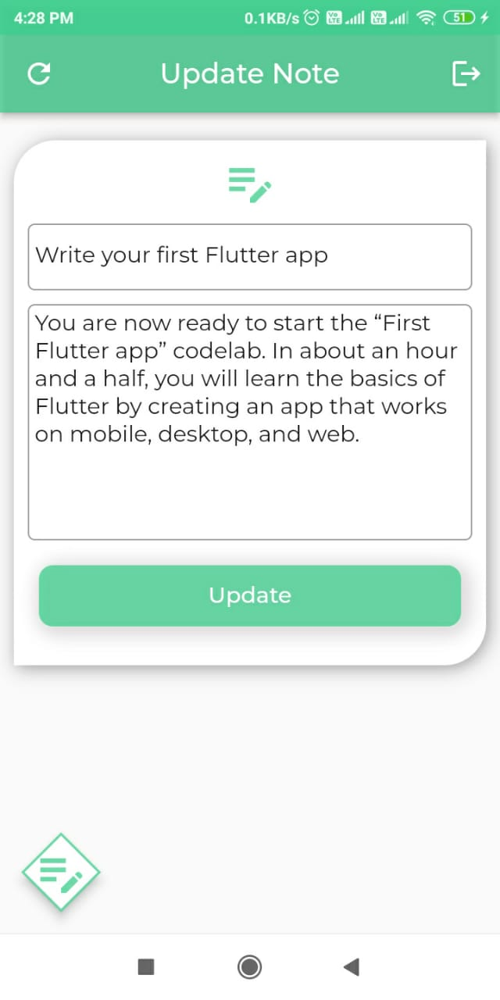

##  supabase_notes Application in Flutter

This is a sample Todo application built with Flutter and Supabase. The application allows users to create, update, and delete to-do items while using Supabase as the backend service for data storage and authentication.

### Features

- User Authentication: Users can sign up, log in, and log out using their email address and password.
- Notes Creation: Users can create new to-do items by entering a title and description.
- Notes Showing: The application displays a list of all the to-do items created by the user.
- Notes Update: Users can edit their existing to-do items.
- Notes Deletion: Users can remove a to-do item from the list.

### Setup

1. Clone this repository to your local machine:

   ```bash
   git clone https://github.com/Bhismydv/supabase_notes.git
   ```

2. Navigate to the project directory:

   ```bash
   cd supabase_notes
   ```

3. Install the dependencies:

   ```bash
   flutter pub get
   ```

4. Open the `lib/networkingt/url_provider.dart` file and update the `supabaseUrl` and `supabaseKey` variables with your Supabase API URL and API Key respectively.

5. Launch the application:

   ```bash
   flutter run
   ```

### Screenshots

Screenshots of the application to showcase its appearance and functionality._

<p align="center">
<br><br>
<br><br>
</p>

### Acknowledgements

This project was inspired by the official Supabase Todo example and built using the Flutter framework.

### Contact

If you have any questions or suggestions, feel free to reach out to me at bhismydv2912gmail.com.

